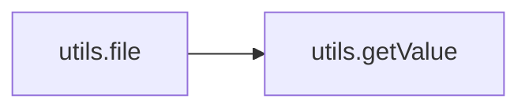

# Key Objects

[_Documentation generated by Documatic_](https://www.documatic.com)

<!---Documatic-section-utils.connect_to_otx_api-start--->
## utils.connect_to_otx_api

<!---Documatic-section-connect_to_otx_api-start--->
<!---Documatic-block-utils.connect_to_otx_api-start--->
<details>
	<summary><code>utils.connect_to_otx_api</code> code snippet</summary>

```python
def connect_to_otx_api(api_key: str):
    try:
        otx = OTXv2(api_key)
        return otx
    except Exception as e:
        return e
```
</details>
<!---Documatic-block-utils.connect_to_otx_api-end--->
<!---Documatic-section-connect_to_otx_api-end--->

# #
<!---Documatic-section-utils.connect_to_otx_api-end--->

<!---Documatic-section-utils.file-start--->
## utils.file

<!---Documatic-section-file-start--->


### Object Calls

* utils.getValue

<!---Documatic-block-utils.file-start--->
<details>
	<summary><code>utils.file</code> code snippet</summary>

```python
def file(otx, hash):
    try:
        alerts = []
        hash_type = IndicatorTypes.FILE_HASH_MD5
        if len(hash) == 64:
            hash_type = IndicatorTypes.FILE_HASH_SHA256
        if len(hash) == 40:
            hash_type = IndicatorTypes.FILE_HASH_SHA1
        result = otx.get_indicator_details_full(hash_type, hash)
        avg = getValue(result, ['analysis', 'analysis', 'plugins', 'avg', 'results', 'detection'])
        if avg:
            alerts.append({'avg': avg})
        clamav = getValue(result, ['analysis', 'analysis', 'plugins', 'clamav', 'results', 'detection'])
        if clamav:
            alerts.append({'clamav': clamav})
        avast = getValue(result, ['analysis', 'analysis', 'plugins', 'avast', 'results', 'detection'])
        if avast:
            alerts.append({'avast': avast})
        microsoft = getValue(result, ['analysis', 'analysis', 'plugins', 'cuckoo', 'result', 'virustotal', 'scans', 'Microsoft', 'result'])
        if microsoft:
            alerts.append({'microsoft': microsoft})
        symantec = getValue(result, ['analysis', 'analysis', 'plugins', 'cuckoo', 'result', 'virustotal', 'scans', 'Symantec', 'result'])
        if symantec:
            alerts.append({'symantec': symantec})
        kaspersky = getValue(result, ['analysis', 'analysis', 'plugins', 'cuckoo', 'result', 'virustotal', 'scans', 'Kaspersky', 'result'])
        if kaspersky:
            alerts.append({'kaspersky': kaspersky})
        suricata = getValue(result, ['analysis', 'analysis', 'plugins', 'cuckoo', 'result', 'suricata', 'rules', 'name'])
        if suricata and 'trojan' in str(suricata).lower():
            alerts.append({'suricata': suricata})
        return alerts
    except Exception as e:
        return e
```
</details>
<!---Documatic-block-utils.file-end--->
<!---Documatic-section-file-end--->

# #
<!---Documatic-section-utils.file-end--->

<!---Documatic-section-utils.make_vt_api_request-start--->
## utils.make_vt_api_request

<!---Documatic-section-make_vt_api_request-start--->
<!---Documatic-block-utils.make_vt_api_request-start--->
<details>
	<summary><code>utils.make_vt_api_request</code> code snippet</summary>

```python
def make_vt_api_request(url: str, api_key: str, search_params: dict):
    try:
        params = {'apikey': api_key}
        params.update(search_params)
        headers = {'User-Agent': 'Pockint v.1.0.0'}
        return requests.get(url, params=params, headers=headers)
    except Exception as e:
        return e
```
</details>
<!---Documatic-block-utils.make_vt_api_request-end--->
<!---Documatic-section-make_vt_api_request-end--->

# #
<!---Documatic-section-utils.make_vt_api_request-end--->

<!---Documatic-section-utils.load_icon-start--->
## utils.load_icon

<!---Documatic-section-load_icon-start--->
<!---Documatic-block-utils.load_icon-start--->
<details>
	<summary><code>utils.load_icon</code> code snippet</summary>

```python
def load_icon():
    icondata = base64.b64decode(icon)
    tempFile = tempfile.gettempdir() + 'icon.ico'
    iconfile = open(tempFile, 'wb')
    iconfile.write(icondata)
    iconfile.close()
    return tempFile
```
</details>
<!---Documatic-block-utils.load_icon-end--->
<!---Documatic-section-load_icon-end--->

# #
<!---Documatic-section-utils.load_icon-end--->

<!---Documatic-section-utils.callback-start--->
## utils.callback

<!---Documatic-section-callback-start--->
<!---Documatic-block-utils.callback-start--->
<details>
	<summary><code>utils.callback</code> code snippet</summary>

```python
def callback(url):
    webbrowser.open_new(url)
```
</details>
<!---Documatic-block-utils.callback-end--->
<!---Documatic-section-callback-end--->

# #
<!---Documatic-section-utils.callback-end--->

<!---Documatic-section-utils.getValue-start--->
## utils.getValue

<!---Documatic-section-getValue-start--->
<!---Documatic-block-utils.getValue-start--->
<details>
	<summary><code>utils.getValue</code> code snippet</summary>

```python
def getValue(results, keys):
    try:
        if type(keys) is list and len(keys) > 0:
            if type(results) is dict:
                key = keys.pop(0)
                if key in results:
                    return getValue(results[key], keys)
                else:
                    return None
            elif type(results) is list and len(results) > 0:
                return getValue(results[0], keys)
            else:
                return results
        else:
            return results
    except Exception as e:
        return e
```
</details>
<!---Documatic-block-utils.getValue-end--->
<!---Documatic-section-getValue-end--->

# #
<!---Documatic-section-utils.getValue-end--->

[_Documentation generated by Documatic_](https://www.documatic.com)